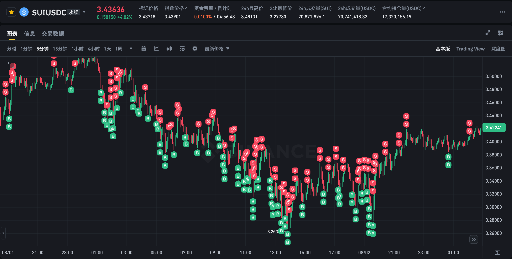
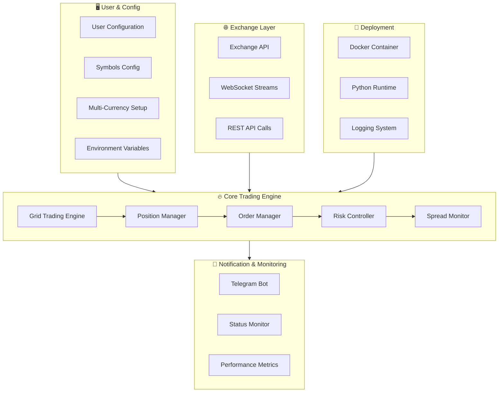
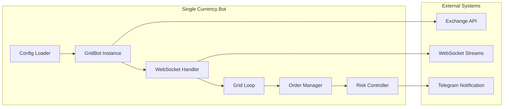
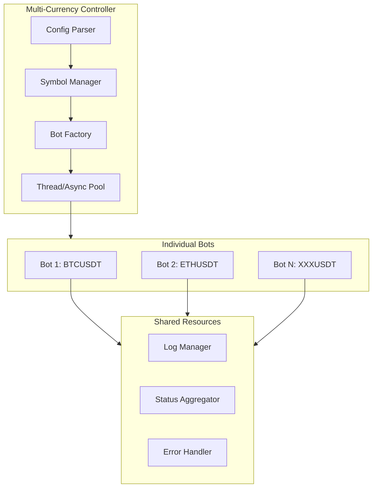
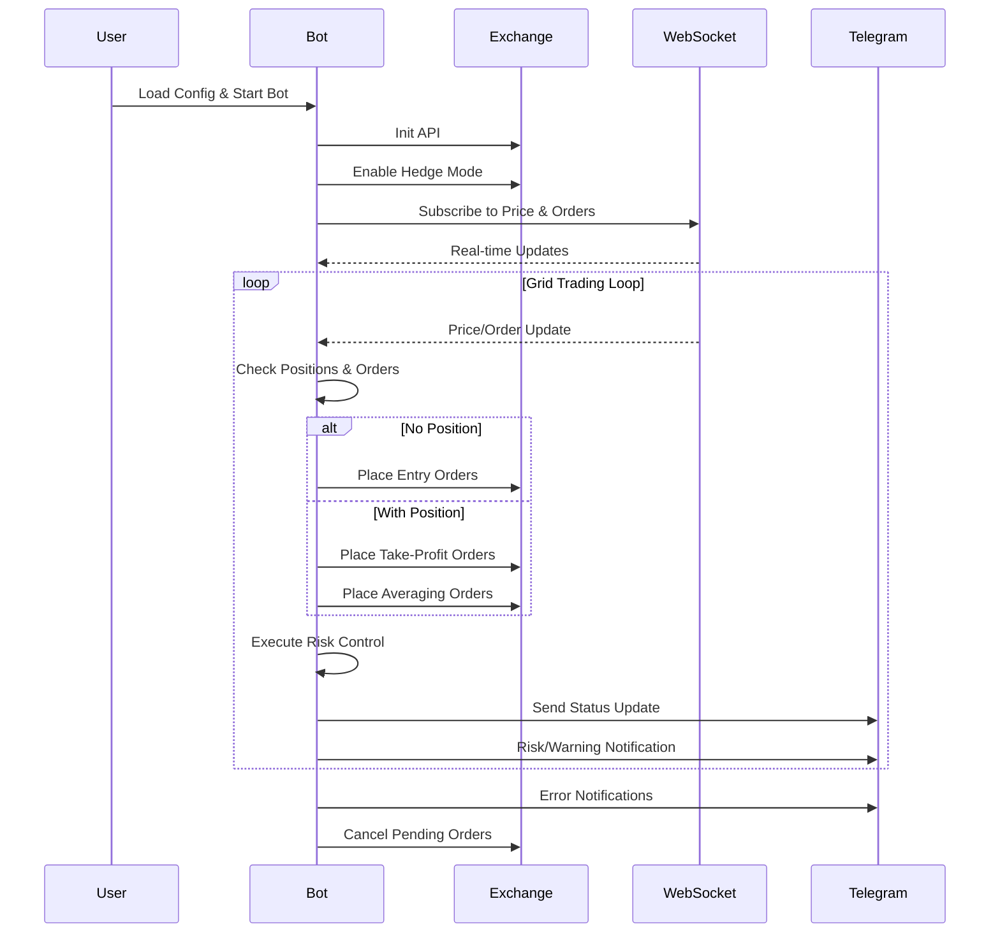

# AS Grid Trading Bot

<div align="center">


</div>

<div align="center">

[English](README.md) | [中文](docs/README_ZN.md)

</div>

<div align="center">


**Advanced Grid Trading Bot with Multi-Exchange Support**

*Intelligent bidirectional grid trading with real-time risk control and multi-currency support*

[🚀 Quick Start](#-quick-start) • [📋 Features](#-features) • [🏗️ Architecture](#️-architecture) • [🔧 Configuration](#-configuration) • [📊 Monitoring](#-monitoring) • [⚠️ Security](#-security)




*SUI/USDC Perpetual Contract Real-time Trading Demo - Intelligent Grid Trading Strategy*

</div>

---

<div align="center">

⭐ **If you like AS-Grid, consider giving it a star!** It helps more traders discover this project.

[](https://github.com/princeniu/AS-Grid)
[](https://github.com/princeniu/AS-Grid)
[](https://github.com/princeniu/AS-Grid/issues)
[](https://github.com/princeniu/AS-Grid/pulls)

[](https://buymeacoffee.com/princeniu)

</div>

---

## 📋 Features

### 🎯 Core Trading Strategy
| Feature | Description | Benefit |
|---------|-------------|---------|
| **Bidirectional Grid Trading** | Simultaneous long/short positions with dynamic adjustment | Enhanced market adaptability and risk distribution |
| **Multi-Currency Support** | Trade multiple currencies simultaneously | Diversified portfolio and higher potential returns |
| **Intelligent Risk Control** | Real-time position monitoring with automatic thresholds | Prevents over-exposure and manages drawdowns |
| **Spread Monitoring** | Automatic grid realignment when spreads exceed thresholds | Maintains optimal grid efficiency |

### 🛡️ Risk Management
- **Position Threshold Management**: Automatic position limits with `POSITION_THRESHOLD` and `POSITION_LIMIT`
- **Inventory Risk Control**: Partial position closing when bidirectional positions reach thresholds
- **Order Timeout Management**: Automatic cancellation of pending orders exceeding 300 seconds
- **Real-time Monitoring**: WebSocket data streams for instant market response

### 🚨 Emergency Position Reduction System
| Feature | Description | Benefit |
|---------|-------------|---------|
| **Emergency Trigger** | Automatically triggers when both long/short positions ≥ 0.8× threshold | Prevents excessive risk exposure during market volatility |
| **Dynamic Thresholds** | Adjusts to 0.75× threshold during extreme volatility | Enhanced protection during market crashes |
| **Batched Reduction** | Executes reduction in configurable batches with millisecond intervals | Minimizes market impact and ensures execution |
| **Smart Order Types** | Prioritizes limit orders with slippage tolerance, falls back to market orders | Optimizes execution price while ensuring completion |
| **Cooldown Protection** | 60-second cooldown prevents rapid re-triggering | Avoids excessive trading during volatile periods |
| **Daily Circuit Breaker** | Halts new positions after 3 daily triggers | Ultimate risk protection for extreme market conditions |

### 🔒 Lockdown Mode (装死模式)
| Feature | Description | Benefit |
|---------|-------------|---------|
| **Single-Side Protection** | Activates when single direction exceeds 1× threshold | Prevents excessive exposure in one direction |
| **Fixed Take-Profit** | Uses calculated take-profit price instead of dynamic adjustment | Maintains profit targets during high-risk periods |
| **Order Management** | Stops opening new positions, only maintains take-profit orders | Reduces risk while preserving profit opportunities |
| **Smart Exit** | Automatically exits when position returns below threshold | Dynamic risk management based on market conditions |

### 🔧 Smart Features
- **Dynamic Grid Adjustment**: Grid spacing optimization based on market conditions
- **Automatic Spread Correction**: Grid realignment when price spreads exceed thresholds
- **Order Cooldown Mechanism**: Prevents excessive trading frequency
- **Precision Adaptation**: Automatic acquisition of trading pair precision requirements

## 🏗️ Architecture

### System Architecture Overview



### Single Currency vs Multi-Currency Architecture

#### Single Currency Mode


#### Multi-Currency Mode


### Trading Flow Architecture



## 🏆 Supported Exchanges

| Exchange | Single Currency | Multi Currency | Risk Control | Recommendation |
|----------|----------------|----------------|--------------|----------------|
| **Binance** | ✅ | ✅ | Advanced | 🏆 **Recommended** |
| **Gate.io** | ✅ | ❌ | Basic | 🥈 Alternative |
| **OKX** | ✅ | ❌ | Basic | 🥉 Legacy |

### Exchange Comparison

**🏆 Binance (Recommended)**
- ✅ Most comprehensive features with extensive optimization
- ✅ Supports both single and multi-currency modes
- ✅ Advanced bidirectional position management
- ✅ Real-time spread monitoring and automatic correction
- ✅ Intelligent profit-taking and risk management
- ✅ Supports USDT and USDC contracts

**🥈 Gate.io (Alternative)**
- ✅ Relatively comprehensive features
- ❌ Single currency mode only
- ✅ Basic grid trading functionality
- ✅ Suitable for simple usage scenarios

**🥉 OKX (Legacy)**
- ⚠️ Basic features only
- ❌ Located in legacy directory, no longer maintained
- ⚠️ Recommended for learning reference only

## 🚀 Quick Start

### Prerequisites
- Docker and Docker Compose installed
- API keys from supported exchanges
- Basic understanding of grid trading strategies

### 1. Clone Repository
```bash
git clone <your-repo-url>
cd grid-trading-bot
```

### 2. Configure Environment

#### Single Currency Mode
```bash
# Copy and configure environment file
cp config/env.example .env
nano .env
```

#### Multi-Currency Mode
```bash
# Configure environment and symbols
cp config/env.example .env
cp config/symbols.yaml config/symbols.yaml.backup
nano .env
nano config/symbols.yaml
```

### 3. Start Trading Bot

#### Single Currency Mode
```bash
# Build and start
./scripts/deploy.sh start

# Or step by step
./scripts/deploy.sh build    # Build image
./scripts/deploy.sh start    # Start container
```

#### Multi-Currency Mode
```bash
# Start multi-currency mode
./scripts/deploy.sh multi-start

# View logs
./scripts/deploy.sh multi-logs
```

## 🔧 Configuration

### Environment Variables

#### Exchange Configuration
```bash
EXCHANGE=binance          # Exchange: binance, gate
CONTRACT_TYPE=USDT        # Contract type: USDT, USDC (Binance only)
```

#### API Configuration (Required)
```bash
API_KEY=your_api_key_here
API_SECRET=your_api_secret_here
```

#### Trading Configuration
```bash
COIN_NAME=X               # Trading currency
GRID_SPACING=0.004       # Grid spacing (0.4%)
INITIAL_QUANTITY=1       # Initial trading quantity
LEVERAGE=20              # Leverage multiplier
```

#### Advanced Configuration (Optimized Defaults)
```bash
# Risk Control Thresholds (Auto-calculated)
POSITION_THRESHOLD=10     # Position lock threshold
POSITION_LIMIT=5         # Position quantity threshold

# Time Controls
ORDER_COOLDOWN_TIME=60   # Reverse order cooldown (seconds)
SYNC_TIME=3             # Data synchronization interval (seconds)

# Spread Monitoring
PRICE_SPREAD_THRESHOLD=0.0004  # Spread threshold (10% of grid spacing)
PRICE_SPREAD_CHECK_INTERVAL=30 # Spread check interval (seconds)
```

#### Emergency Position Reduction Configuration
```bash
# Emergency Reduction Thresholds
EMG_ENTER_RATIO=0.80     # Emergency trigger ratio (0.8× threshold)
EMG_EXIT_RATIO=0.75      # Emergency exit ratio (0.75× threshold)
EMG_COOLDOWN_S=60        # Cooldown period after trigger (seconds)
EMG_BATCHES=2            # Number of reduction batches
EMG_BATCH_SLEEP_MS=300   # Interval between batches (milliseconds)
EMG_SLIP_CAP_BP=15       # Slippage tolerance for limit orders (basis points)
EMG_DAILY_FUSE_COUNT=3   # Daily circuit breaker trigger count

# Grid Pause
GRID_PAUSE_AFTER_EMG_S=90    # Grid pause duration after emergency (seconds)
```

### Multi-Currency Configuration

Create `config/symbols.yaml` for multi-currency mode:

```yaml
symbols:
  - name: BTCUSDT
    grid_spacing: 0.004
    initial_quantity: 0.001
    leverage: 20
    contract_type: USDT
    
  - name: ETHUSDT
    grid_spacing: 0.005
    initial_quantity: 0.01
    leverage: 20
    contract_type: USDT
```

## 📊 Monitoring & Management

### Management Commands
```bash
# View help
./scripts/deploy.sh help

# Single currency mode
./scripts/deploy.sh start          # Start service
./scripts/deploy.sh stop           # Stop service
./scripts/deploy.sh restart        # Restart service
./scripts/deploy.sh logs           # View logs
./scripts/deploy.sh status         # View status

# Multi-currency mode
./scripts/deploy.sh multi-start    # Start multi-currency service
./scripts/deploy.sh multi-logs     # View summary logs
./scripts/deploy.sh bot-logs       # View detailed logs

# General commands
./scripts/deploy.sh build          # Build image
./scripts/deploy.sh cleanup        # Clean up resources
```

### Real-time Monitoring
```bash
# View real-time logs
./scripts/deploy.sh logs

# View local log files
tail -f log/grid_BN.log           # Binance single currency
tail -f log/multi_grid_BN.log     # Multi-currency main log
tail -f log/status_summary.log    # Status summary
```

### Key Monitoring Metrics
- **Position Status**: Long/short position quantities
- **Order Status**: Quantities and prices of various order types
- **Spread Monitoring**: Bid-ask price difference percentage
- **Risk Indicators**: Position threshold proximity
- **System Status**: WebSocket connection and data sync status

## 🧠 Trading Logic

### Grid Strategy Overview
1. **Initialization**: Place entry orders when positions are zero
2. **Position Management**: Place profit-taking and averaging orders when positions exist
3. **Risk Control**: Enable double profit-taking when position exceeds `POSITION_LIMIT`
4. **Spread Control**: Realign grids when spread exceeds threshold
5. **Safety Measures**: Partial position closing and order timeout management

### Risk Management Features
- **Position Thresholds**: Automatic position limits with configurable thresholds
- **Spread Monitoring**: Real-time monitoring with automatic correction
- **Order Management**: Timeout handling and cooldown mechanisms
- **Inventory Control**: Bidirectional position balance management

### 🚨 Emergency Position Reduction Logic
1. **Trigger Conditions**:
   - **Normal Mode**: Triggers when both long/short positions ≥ 0.8× `POSITION_THRESHOLD`
   - **Extreme Volatility**: Automatically adjusts to 0.75× threshold during high volatility periods
   - **Volatility Detection**: Monitors price changes over 60 periods to identify extreme conditions

2. **Execution Process**:
   - **Order Cancellation**: Cancels all non-take-profit orders for affected directions
   - **Batched Reduction**: Divides reduction into configurable batches (default: 2 batches)
   - **Smart Ordering**: Attempts limit orders with slippage tolerance, falls back to market orders
   - **Position Refresh**: Refreshes positions before each batch to ensure accuracy

3. **Post-Reduction Actions**:
   - **Grid Pause**: Pauses new grid orders for 60-120 seconds
   - **Daily Circuit Breaker**: Activates after 3 daily triggers, halting new positions for the day

### 🔒 Lockdown Mode Logic
1. **Activation Conditions**:
   - **Single Direction**: Triggers when long or short position exceeds 1× `POSITION_THRESHOLD`
   - **Take-Profit Calculation**: Computes optimal take-profit price based on position ratios
   - **Price Constraints**: Applies min/max constraints to prevent extreme take-profit levels

2. **Operation Mode**:
   - **Position Freeze**: Stops opening new positions in the affected direction
   - **Fixed Take-Profit**: Maintains take-profit orders at calculated price levels
   - **Order Management**: Only places take-profit orders, no new entry orders

3. **Exit Conditions**:
   - **Automatic Exit**: Exits lockdown mode when position returns below 1× threshold
   - **Normal Operation**: Resumes standard grid trading operations
   - **State Reset**: Clears lockdown mode flags and take-profit price records

## 🐳 Docker Architecture

- **Base Image**: Python 3.9 Slim
- **Runtime User**: Non-root user (trader)
- **Resource Limits**: Memory 512M, CPU 0.5 cores
- **Health Check**: Program status check every 30 seconds
- **Auto Restart**: Automatic restart on abnormal exit

## 📁 Project Structure

```
.
├── config/                # Configuration files
│   ├── symbols.yaml       # Multi-currency configuration
│   ├── symbols.json       # JSON format configuration
│   └── env.example        # Environment variables template
├── scripts/               # Management scripts
│   ├── deploy.sh          # Deployment and management
│   ├── start.sh           # Startup script
│   └── health_check.py    # Health check script
├── docker/                # Docker configuration
│   ├── Dockerfile         # Docker image build
│   ├── docker-compose.yml # Docker Compose config
│   └── .dockerignore      # Docker ignore file
├── src/                   # Source code
│   ├── single_bot/        # Single currency bots
│   │   ├── binance_bot.py # Binance single currency
│   │   └── gate_bot.py    # Gate.io single currency
│   └── multi_bot/         # Multi-currency bots
│       ├── binance_multi_bot.py # Binance multi-currency
│       └── multi_bot.py   # Multi-currency entry
├── docs/                  # Documentation
├── legacy/                # Legacy code
├── log/                   # Log directory (persistent)
├── requirements.txt        # Python dependencies
└── README.md              # Documentation
```

## ⚠️ Security & Risk Management

### API Security
- **Permission Settings**: Enable only necessary contract trading permissions
- **IP Whitelist**: Set API IP whitelist in exchange
- **Key Protection**: Never commit `.env` file to version control

### Risk Control Recommendations
- **Test Environment**: Run on testnet or small capital environment first
- **Parameter Tuning**: Adjust grid spacing and quantities based on currency characteristics
- **Position Monitoring**: Regularly check position status to avoid over-concentration
- **Market Adaptation**: Consider pausing bot during extreme market conditions

### System Security
- **Network Isolation**: Containers run in isolated network environment
- **Log Management**: Regular log file cleanup to prevent disk space issues
- **Permission Control**: Non-root user execution to reduce security risks

## 🔧 Troubleshooting

### Common Issues

1. **API Connection Failure**
   ```bash
   # Check API configuration
   grep API_KEY .env
   
   # View error logs
   ./scripts/deploy.sh logs
   
   # Test connectivity
   curl -I https://fapi.binance.com
   ```

2. **Container Startup Issues**
   ```bash
   # Check configuration
   docker-compose config
   
   # View container status
   docker ps -a
   
   # Check resources
   docker stats
   ```

3. **Permission Issues**
   ```bash
   # Fix log directory permissions
   chmod 755 log/
   sudo chown 1000:1000 log/
   ```

### Performance Optimization
- Adjust `SYNC_TIME` to balance real-time performance and efficiency
- Monitor memory usage and restart container when necessary
- Adjust container resource limits based on server performance

## 📞 Support

For issues and questions:
1. Check log files for detailed error information
2. Verify configuration parameters are correct
3. Confirm exchange API permission settings
4. Test network connectivity and exchange service status

### Performance Recommendations
- Use Binance for most comprehensive features and best performance
- Start with single currency mode for beginners
- Gradually scale to multi-currency mode for experienced users
- Monitor system resources and adjust container limits accordingly

---

## 📈 Risk Warning

**⚠️ Important Disclaimer**: This software is for educational and research purposes only. Users bear all trading risks. Grid trading may face significant losses in trending markets. Please use with caution based on your risk tolerance.

**Key Risk Factors**:
- Grid trading is suitable for sideways markets, trending markets carry higher risks
- Leveraged trading is extremely risky and may result in total capital loss
- Ensure full understanding of trading mechanisms before use
- Consider setting stop-loss mechanisms to avoid major losses in extreme situations

**🚨 Emergency System Considerations**:
- **Emergency Reduction**: May trigger during high volatility, resulting in position closures
- **Lockdown Mode**: Can pause trading in one direction, affecting overall strategy performance
- **Daily Circuit Breaker**: Extreme protection may halt all new positions for extended periods

**📊 Risk Management Tips**:
- Start with small amounts and gradually increase
- Monitor positions regularly and adjust parameters as needed
- Consider market conditions when deciding to run the bot
- Always maintain adequate account balance for margin requirements

---

<div align="center">

**Made with ❤️ for the crypto trading community**

</div>
