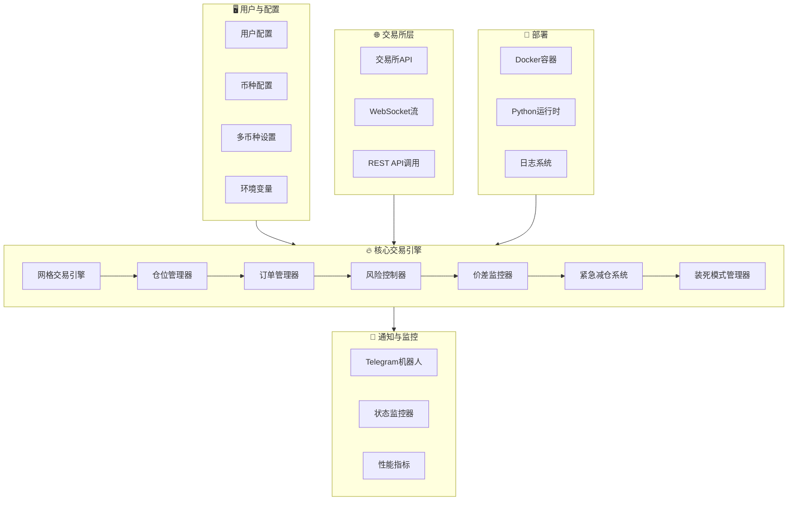
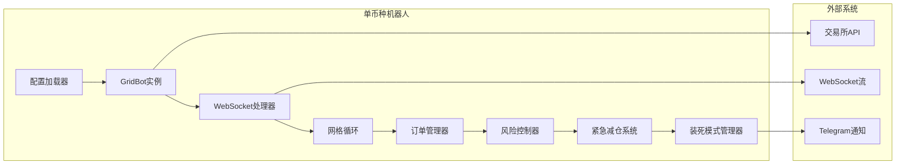
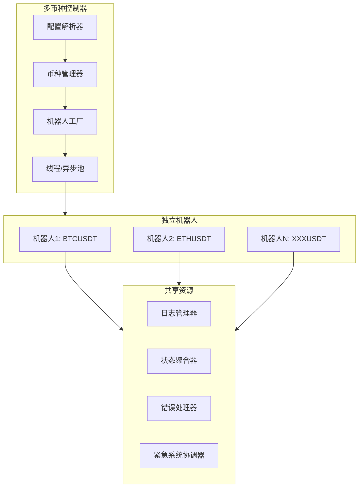
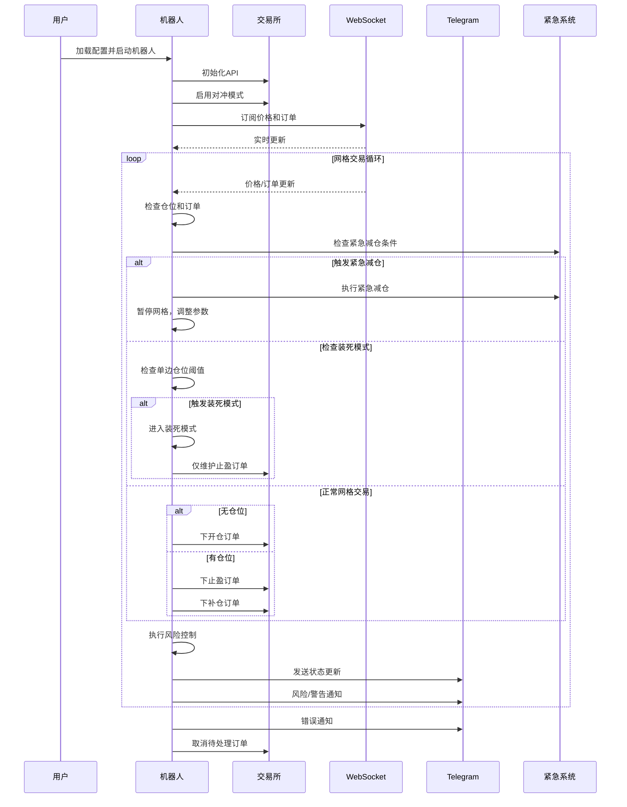

# AS 网格交易机器人

<div align="center">


</div>

<div align="center">

[English](../README.md) | [中文](README_ZN.md)

</div>

<div align="center">


**支持多交易所的高级网格交易机器人**

*智能双向网格交易，实时风险控制，多币种支持*

[🚀 快速开始](#-快速开始) • [📋 功能特性](#-功能特性) • [🏗️ 系统架构](#️-系统架构) • [🔧 配置说明](#-配置说明) • [📊 监控管理](#-监控管理) • [⚠️ 安全风险](#-安全风险)


*SUI/USDC 永续合约实时交易演示 - 智能网格交易策略*

</div>

---

<div align="center">

⭐ **如果您喜欢 AS-Grid，请给它一个星标！** 这有助于更多交易者发现这个项目。

[](https://github.com/princeniu/AS-Grid)
[](https://github.com/princeniu/AS-Grid)
[](https://github.com/princeniu/AS-Grid/issues)
[](https://github.com/princeniu/AS-Grid/pulls)

[](https://buymeacoffee.com/princeniu)

</div>

---

## 📋 功能特性

### 🎯 核心交易策略
| 功能 | 描述 | 优势 |
|------|------|------|
| **双向网格交易** | 同时持有多空仓位，动态调整策略 | 增强市场适应性，分散风险 |
| **多币种支持** | 同时交易多个币种 | 投资组合多样化，提高潜在收益 |
| **智能风险控制** | 实时仓位监控，自动阈值管理 | 防止过度暴露，管理回撤 |
| **价差监控** | 价差超过阈值时自动重新对齐网格 | 保持最佳网格效率 |

### 🛡️ 风险管理
- **仓位阈值管理**: 通过 `POSITION_THRESHOLD` 和 `POSITION_LIMIT` 自动仓位限制
- **库存风险控制**: 双向仓位达到阈值时部分平仓
- **订单超时管理**: 自动取消超过300秒的待处理订单
- **实时监控**: WebSocket数据流实现即时市场响应

### 🚨 紧急减仓系统
| 功能 | 描述 | 优势 |
|------|------|------|
| **紧急触发** | 当多空仓位同时≥0.8×阈值时自动触发 | 防止市场波动期间过度风险暴露 |
| **动态阈值** | 极端波动期间自动调整至0.75×阈值 | 市场崩盘期间增强保护 |
| **分批减仓** | 可配置批次执行，毫秒级间隔 | 最小化市场影响，确保执行 |
| **智能订单类型** | 优先限价单（带滑点容忍），失败时市价单 | 优化执行价格，确保完成 |
| **冷却保护** | 60秒冷却期防止快速重触发 | 避免波动期间过度交易 |
| **日内熔断器** | 每日触发3次后暂停新开仓 | 极端市场条件下的终极风险保护 |

### 🔒 装死模式（Lockdown Mode）
| 功能 | 描述 | 优势 |
|------|------|------|
| **单边保护** | 单方向超过1×阈值时激活 | 防止单方向过度暴露 |
| **固定止盈** | 使用计算得出的止盈价格而非动态调整 | 高风险期间保持盈利目标 |
| **订单管理** | 停止开新仓，仅维护止盈订单 | 降低风险同时保留盈利机会 |
| **智能退出** | 仓位回到阈值以下时自动退出 | 基于市场条件的动态风险管理 |

### 🔧 智能功能
- **动态网格调整**: 基于市场条件的网格间距优化
- **自动价差修正**: 价差超过阈值时网格重新对齐
- **订单冷却机制**: 防止过度交易频率
- **精度自适应**: 自动获取交易对精度要求

## 🏗️ 系统架构

### 系统架构概览



### 单币种 vs 多币种架构

#### 单币种模式


#### 多币种模式


### 交易流程架构



## 🏆 支持的交易所

| 交易所 | 单币种 | 多币种 | 风险控制 | 推荐度 |
|--------|--------|--------|----------|--------|
| **Binance** | ✅ | ✅ | 高级 | 🏆 **推荐** |
| **Gate.io** | ✅ | ❌ | 基础 | 🥈 备选 |
| **OKX** | ✅ | ❌ | 基础 | 🥉 历史 |

### 交易所对比

**🏆 Binance (推荐)**
- ✅ 功能最全面，优化程度最高
- ✅ 支持单币种和多币种模式
- ✅ 高级双向仓位管理
- ✅ 实时价差监控和自动修正
- ✅ 智能止盈和风险管理
- ✅ 支持USDT和USDC合约
- ✅ 完整的紧急减仓和装死模式

**🥈 Gate.io (备选)**
- ✅ 功能相对全面
- ❌ 仅单币种模式
- ✅ 基础网格交易功能
- ✅ 适合简单使用场景

**🥉 OKX (历史)**
- ⚠️ 仅基础功能
- ❌ 位于legacy目录，不再维护
- ⚠️ 仅推荐学习参考

## 🚀 快速开始

### 前置要求
- 安装Docker和Docker Compose
- 支持交易所的API密钥
- 对网格交易策略的基本理解

### 1. 克隆仓库
```bash
git clone <your-repo-url>
cd grid-trading-bot
```

### 2. 配置环境

#### 单币种模式
```bash
# 复制并配置环境文件
cp config/env.example .env
nano .env
```

#### 多币种模式
```bash
# 配置环境和币种
cp config/env.example .env
cp config/symbols.yaml config/symbols.yaml.backup
nano .env
nano config/symbols.yaml
```

### 3. 启动交易机器人

#### 单币种模式
```bash
# 构建并启动
./scripts/deploy.sh start

# 或分步执行
./scripts/deploy.sh build    # 构建镜像
./scripts/deploy.sh start    # 启动容器
```

#### 多币种模式
```bash
# 启动多币种模式
./scripts/deploy.sh multi-start

# 查看日志
./scripts/deploy.sh multi-logs
```

## 🔧 配置说明

### 环境变量

#### 交易所配置
```bash
EXCHANGE=binance          # 交易所: binance, gate
CONTRACT_TYPE=USDT        # 合约类型: USDT, USDC (仅Binance)
```

#### API配置 (必需)
```bash
API_KEY=your_api_key_here
API_SECRET=your_api_secret_here
```

#### 交易配置
```bash
COIN_NAME=X               # 交易币种
GRID_SPACING=0.004       # 网格间距 (0.4%)
INITIAL_QUANTITY=1       # 初始交易数量
LEVERAGE=20              # 杠杆倍数
```

#### 高级配置 (优化默认值)
```bash
# 风险控制阈值 (自动计算)
POSITION_THRESHOLD=10     # 仓位锁定阈值
POSITION_LIMIT=5         # 仓位数量阈值

# 时间控制
ORDER_COOLDOWN_TIME=60   # 反向订单冷却时间 (秒)
SYNC_TIME=3             # 数据同步间隔 (秒)

# 价差监控
PRICE_SPREAD_THRESHOLD=0.0004  # 价差阈值 (网格间距的10%)
PRICE_SPREAD_CHECK_INTERVAL=30 # 价差检查间隔 (秒)
```

#### 紧急减仓配置
```bash
# 紧急减仓阈值
EMG_ENTER_RATIO=0.80     # 紧急触发比例 (0.8×阈值)
EMG_EXIT_RATIO=0.75      # 紧急退出比例 (0.75×阈值)
EMG_COOLDOWN_S=60        # 触发后冷却期 (秒)
EMG_BATCHES=2            # 减仓批次数
EMG_BATCH_SLEEP_MS=300   # 批次间隔 (毫秒)
EMG_SLIP_CAP_BP=15       # 限价单滑点容忍 (基点)
EMG_DAILY_FUSE_COUNT=3   # 日内熔断器触发次数

# 网格暂停和参数恢复
GRID_PAUSE_AFTER_EMG_S=90    # 紧急后网格暂停时长 (秒)
EMG_QUANTITY_RATIO=0.70      # 临时数量减少比例
EMG_GRID_SPACING_RATIO=1.30  # 临时网格间距增加比例
EMG_PARAM_RECOVER_INTERVAL=300  # 参数恢复间隔 (秒)
```

### 多币种配置

为多币种模式创建 `config/symbols.yaml`:

```yaml
symbols:
  - name: BTCUSDT
    grid_spacing: 0.004
    initial_quantity: 0.001
    leverage: 20
    contract_type: USDT
    
  - name: ETHUSDT
    grid_spacing: 0.005
    initial_quantity: 0.01
    leverage: 20
    contract_type: USDT
```

## 📊 监控与管理

### 管理命令
```bash
# 查看帮助
./scripts/deploy.sh help

# 单币种模式
./scripts/deploy.sh start          # 启动服务
./scripts/deploy.sh stop           # 停止服务
./scripts/deploy.sh restart        # 重启服务
./scripts/deploy.sh logs           # 查看日志
./scripts/deploy.sh status         # 查看状态

# 多币种模式
./scripts/deploy.sh multi-start    # 启动多币种服务
./scripts/deploy.sh multi-logs     # 查看汇总日志
./scripts/deploy.sh bot-logs       # 查看详细日志

# 通用命令
./scripts/deploy.sh build          # 构建镜像
./scripts/deploy.sh cleanup        # 清理资源
```

### 实时监控
```bash
# 查看实时日志
./scripts/deploy.sh logs

# 查看本地日志文件
tail -f log/grid_BN.log           # Binance单币种
tail -f log/multi_grid_BN.log     # 多币种主日志
tail -f log/status_summary.log    # 状态汇总
```

### 关键监控指标
- **仓位状态**: 多空仓位数量
- **订单状态**: 各类订单的数量和价格
- **价差监控**: 买卖价差百分比
- **风险指标**: 仓位阈值接近程度
- **系统状态**: WebSocket连接和数据同步状态
- **紧急系统**: 紧急减仓和装死模式状态

## 🧠 交易逻辑

### 网格策略概览
1. **初始化**: 仓位为零时下开仓订单
2. **仓位管理**: 有仓位时下止盈和补仓订单
3. **风险控制**: 仓位超过 `POSITION_LIMIT` 时启用双倍止盈
4. **价差控制**: 价差超过阈值时重新对齐网格
5. **安全措施**: 部分仓位平仓和订单超时管理

### 风险管理功能
- **仓位阈值**: 可配置阈值的自动仓位限制
- **价差监控**: 实时监控和自动修正
- **订单管理**: 超时处理和冷却机制
- **库存控制**: 双向仓位平衡管理

### 🚨 紧急减仓逻辑
1. **触发条件**:
   - **正常模式**: 当多空仓位同时≥0.8× `POSITION_THRESHOLD` 时触发
   - **极端波动**: 高波动期间自动调整至0.75×阈值
   - **波动检测**: 监控60个周期的价格变化识别极端条件

2. **执行过程**:
   - **订单取消**: 取消受影响方向的所有非止盈订单
   - **分批减仓**: 将减仓分为可配置批次 (默认: 2批次)
   - **智能下单**: 尝试限价单（带滑点容忍），失败时市价单
   - **仓位刷新**: 每批次前刷新仓位确保准确性

3. **减仓后操作**:
   - **网格暂停**: 暂停新网格订单60-120秒
   - **参数调整**: 临时将数量降至70%，网格间距增至130%
   - **逐步恢复**: 每5分钟自动恢复参数 (10%增量)
   - **日内熔断器**: 每日触发3次后激活，当日暂停新开仓

### 🔒 装死模式逻辑
1. **激活条件**:
   - **单边触发**: 当多或空仓位超过1× `POSITION_THRESHOLD` 时触发
   - **止盈计算**: 基于仓位比例计算最优止盈价格
   - **价格约束**: 应用最小/最大约束防止极端止盈水平

2. **运行模式**:
   - **仓位冻结**: 停止受影响方向的新开仓
   - **固定止盈**: 在计算价格水平维护止盈订单
   - **订单管理**: 仅下止盈订单，无新开仓订单

3. **退出条件**:
   - **自动退出**: 仓位回到1×阈值以下时自动退出
   - **正常运行**: 恢复标准网格交易操作
   - **状态重置**: 清除装死模式标志和止盈价格记录

## 🐳 Docker架构

- **基础镜像**: Python 3.9 Slim
- **运行用户**: 非root用户 (trader)
- **资源限制**: 内存512M，CPU 0.5核
- **健康检查**: 每30秒程序状态检查
- **自动重启**: 异常退出时自动重启

## 📁 项目结构

```
.
├── config/                # 配置文件
│   ├── symbols.yaml       # 多币种配置
│   ├── symbols.json       # JSON格式配置
│   └── env.example        # 环境变量模板
├── scripts/               # 管理脚本
│   ├── deploy.sh          # 部署和管理
│   ├── start.sh           # 启动脚本
│   └── health_check.py    # 健康检查脚本
├── docker/                # Docker配置
│   ├── Dockerfile         # Docker镜像构建
│   ├── docker-compose.yml # Docker Compose配置
│   └── .dockerignore      # Docker忽略文件
├── src/                   # 源代码
│   ├── single_bot/        # 单币种机器人
│   │   ├── binance_bot.py # Binance单币种
│   │   └── gate_bot.py    # Gate.io单币种
│   └── multi_bot/         # 多币种机器人
│       ├── binance_multi_bot.py # Binance多币种
│       └── multi_bot.py   # 多币种入口
├── docs/                  # 文档
├── legacy/                # 历史代码
├── log/                   # 日志目录 (持久化)
├── requirements.txt        # Python依赖
└── README.md              # 文档
```

## ⚠️ 安全与风险管理

### API安全
- **权限设置**: 仅启用必要的合约交易权限
- **IP白名单**: 在交易所设置API IP白名单
- **密钥保护**: 切勿将 `.env` 文件提交到版本控制

### 风险控制建议
- **测试环境**: 先在测试网或小资金环境运行
- **参数调优**: 根据币种特性调整网格间距和数量
- **仓位监控**: 定期检查仓位状态避免过度集中
- **市场适应**: 极端市场条件下考虑暂停机器人

### 系统安全
- **网络隔离**: 容器在隔离网络环境中运行
- **日志管理**: 定期清理日志文件防止磁盘空间问题
- **权限控制**: 非root用户执行减少安全风险

## 🔧 故障排除

### 常见问题

1. **API连接失败**
   ```bash
   # 检查API配置
   grep API_KEY .env
   
   # 查看错误日志
   ./scripts/deploy.sh logs
   
   # 测试连接性
   curl -I https://fapi.binance.com
   ```

2. **容器启动问题**
   ```bash
   # 检查配置
   docker-compose config
   
   # 查看容器状态
   docker ps -a
   
   # 检查资源
   docker stats
   ```

3. **权限问题**
   ```bash
   # 修复日志目录权限
   chmod 755 log/
   sudo chown 1000:1000 log/
   ```

### 性能优化
- 调整 `SYNC_TIME` 平衡实时性能效率
- 监控内存使用，必要时重启容器
- 根据服务器性能调整容器资源限制

## 📞 支持

对于问题和疑问：
1. 检查日志文件获取详细错误信息
2. 验证配置参数正确性
3. 确认交易所API权限设置
4. 测试网络连接和交易所服务状态

### 性能建议
- 使用Binance获得最全面功能和最佳性能
- 初学者从单币种模式开始
- 有经验用户逐步扩展到多币种模式
- 监控系统资源并相应调整容器限制

---

## 📈 风险警告

**⚠️ 重要免责声明**: 本软件仅供教育和研究目的。用户承担所有交易风险。网格交易在趋势市场中可能面临重大损失。请根据您的风险承受能力谨慎使用。

**主要风险因素**:
- 网格交易适合横盘市场，趋势市场风险较高
- 杠杆交易极其危险，可能导致全部资金损失
- 使用前确保完全理解交易机制
- 考虑设置止损机制避免极端情况下的重大损失

**🚨 紧急系统注意事项**:
- **紧急减仓**: 高波动期间可能触发，导致仓位平仓
- **装死模式**: 可能暂停单方向交易，影响整体策略表现
- **参数变化**: 临时调整可能影响恢复期间的盈利潜力
- **日内熔断器**: 极端保护可能长时间暂停所有新开仓

**📊 风险管理建议**:
- 从小额开始，逐步增加
- 定期监控仓位，根据需要调整参数
- 决定运行机器人时考虑市场条件
- 始终维持足够的账户余额满足保证金要求

---

<div align="center">

**为加密货币交易社区用心制作 ❤️**

</div>
