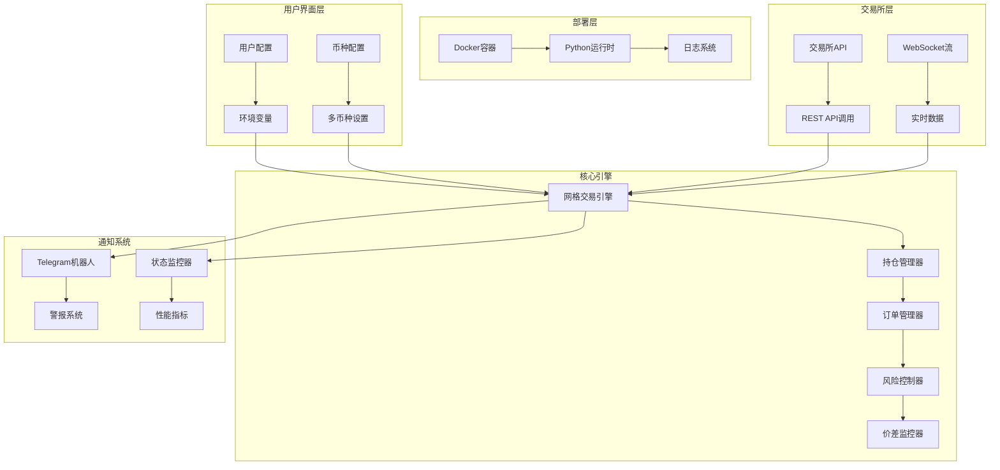
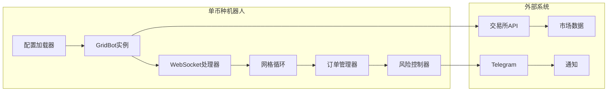
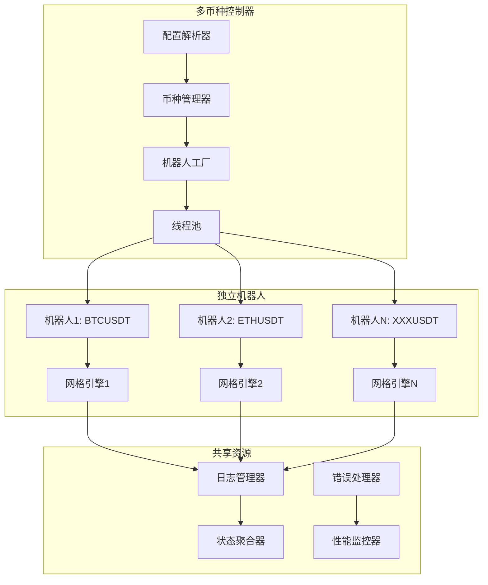
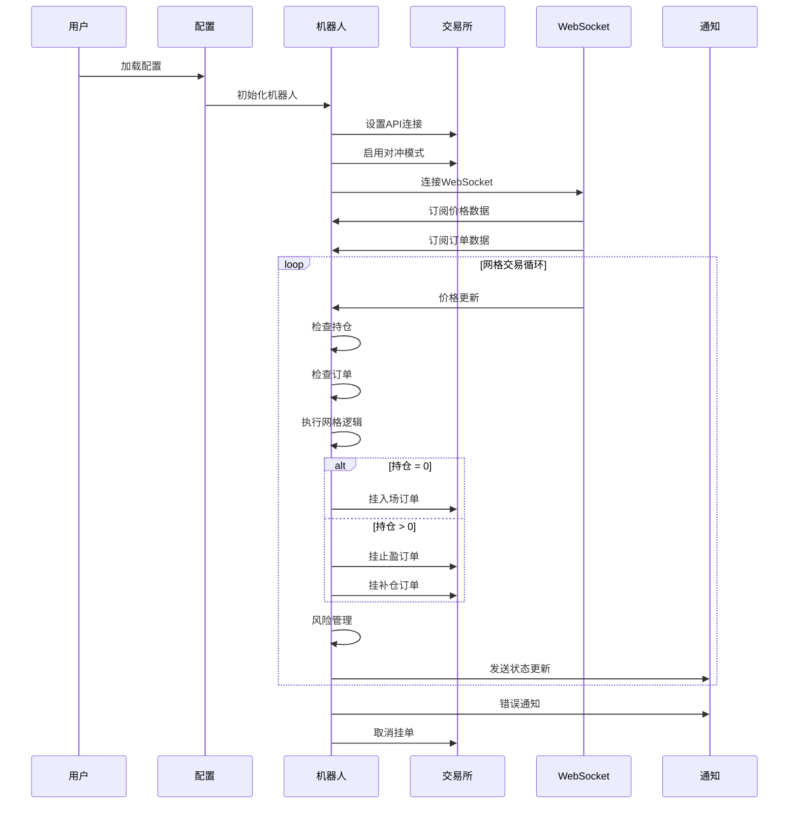

# AS网格交易机器人

[English](README.md) | [中文](docs/README_ZN.md)

<div align="center">


**高级网格交易机器人 - 多交易所支持**

*智能双向网格交易，实时风险控制，多币种支持*

[🚀 快速开始](#-快速开始) • [📋 功能特性](#-功能特性) • [🏗️ 系统架构](#️-系统架构) • [🔧 配置说明](#-配置说明) • [📊 监控管理](#-监控管理) • [⚠️ 安全风险](#-安全风险)

</div>

---

<div align="center">

⭐ **如果您喜欢 AS-Grid，请给它一个星标！** 这有助于更多交易者发现这个项目。

[](https://github.com/princeniu/AS-Grid)
[](https://github.com/princeniu/AS-Grid)
[](https://github.com/princeniu/AS-Grid/issues)
[](https://github.com/princeniu/AS-Grid/pulls)

</div>

---

## 📋 功能特性

### 🎯 核心交易策略
| 功能 | 描述 | 优势 |
|------|------|------|
| **双向网格交易** | 同时进行多头/空头持仓，动态调整 | 增强市场适应性，分散风险 |
| **多币种支持** | 同时交易多个币种 | 投资组合多样化，提高潜在收益 |
| **智能风险控制** | 实时持仓监控，自动阈值管理 | 防止过度暴露，管理回撤 |
| **价差监控** | 价差超过阈值时自动重新对齐网格 | 保持最佳网格效率 |

### 🛡️ 风险管理
- **持仓阈值管理**: 自动持仓限制，配置 `POSITION_THRESHOLD` 和 `POSITION_LIMIT`
- **库存风险控制**: 双向持仓达到阈值时自动部分平仓
- **订单超时管理**: 超过300秒未成交的挂单自动取消
- **实时监控**: WebSocket数据流实现即时市场响应

### 🔧 智能功能
- **动态网格调整**: 根据市场条件优化网格间距
- **自动价差纠正**: 价差超过阈值时自动重新对齐网格
- **订单冷却机制**: 防止过度频繁交易
- **精度自适应**: 自动获取交易对的价格和数量精度

## 🏗️ 系统架构

### 整体架构概览



### 单币种 vs 多币种架构

#### 单币种模式


#### 多币种模式


### 交易流程架构



## 🏆 支持的交易所

| 交易所 | 单币种 | 多币种 | 风险控制 | 推荐指数 |
|--------|--------|--------|----------|----------|
| **币安** | ✅ | ✅ | 高级 | 🏆 **推荐** |
| **Gate.io** | ✅ | ❌ | 基础 | 🥈 备选 |
| **OKX** | ✅ | ❌ | 基础 | 🥉 旧版 |

### 交易所对比

**🏆 币安 (推荐)**
- ✅ 功能最完善，经过大量优化
- ✅ 支持单币种和多币种模式
- ✅ 高级双向持仓管理
- ✅ 实时价差监控和自动纠正
- ✅ 智能止盈和风险管理系统
- ✅ 支持 USDT 和 USDC 合约

**🥈 Gate.io (备选)**
- ✅ 功能相对完善
- ❌ 仅支持单币种模式
- ✅ 基本的网格交易功能
- ✅ 适合简单使用场景

**🥉 OKX (旧版)**
- ⚠️ 仅提供基本功能
- ❌ 位于 legacy 目录，不再维护
- ⚠️ 建议仅用于学习参考

## 🚀 快速开始

### 前置要求
- 安装 Docker 和 Docker Compose
- 获取支持交易所的 API 密钥
- 基本了解网格交易策略

### 1. 克隆项目
```bash
git clone <your-repo-url>
cd grid-trading-bot
```

### 2. 配置环境

#### 单币种模式
```bash
# 复制并配置环境文件
cp config/env.example .env
nano .env
```

#### 多币种模式
```bash
# 配置环境和币种
cp config/env.example .env
cp config/symbols.yaml config/symbols.yaml.backup
nano .env
nano config/symbols.yaml
```

### 3. 启动交易机器人

#### 单币种模式
```bash
# 构建并启动
./scripts/deploy.sh start

# 或者分步执行
./scripts/deploy.sh build    # 构建镜像
./scripts/deploy.sh start    # 启动容器
```

#### 多币种模式
```bash
# 启动多币种模式
./scripts/deploy.sh multi-start

# 查看日志
./scripts/deploy.sh multi-logs
```

## 🔧 配置说明

### 环境变量

#### 交易所配置
```bash
EXCHANGE=binance          # 交易所: binance, gate
CONTRACT_TYPE=USDT        # 合约类型: USDT, USDC (仅币安需要)
```

#### API 配置 (必填)
```bash
API_KEY=your_api_key_here
API_SECRET=your_api_secret_here
```

#### 交易配置
```bash
COIN_NAME=X               # 交易币种
GRID_SPACING=0.004       # 网格间距 (0.4%)
INITIAL_QUANTITY=1       # 初始交易数量
LEVERAGE=20              # 杠杆倍数
```

#### 高级配置 (优化默认值)
```bash
# 风险控制阈值 (自动计算)
POSITION_THRESHOLD=10     # 锁仓阈值
POSITION_LIMIT=5         # 持仓数量阈值

# 时间控制
ORDER_COOLDOWN_TIME=60   # 反向挂单冷却时间 (秒)
SYNC_TIME=3             # 数据同步间隔 (秒)

# 价差监控
PRICE_SPREAD_THRESHOLD=0.0004  # 价差阈值 (网格间距的10%)
PRICE_SPREAD_CHECK_INTERVAL=30 # 价差检查间隔 (秒)
```

### 多币种配置

创建 `config/symbols.yaml` 文件配置多币种模式：

```yaml
symbols:
  - name: BTCUSDT
    grid_spacing: 0.004
    initial_quantity: 0.001
    leverage: 20
    contract_type: USDT
    
  - name: ETHUSDT
    grid_spacing: 0.005
    initial_quantity: 0.01
    leverage: 20
    contract_type: USDT
```

## 📊 监控管理

### 管理命令
```bash
# 查看帮助
./scripts/deploy.sh help

# 单币种模式
./scripts/deploy.sh start          # 启动服务
./scripts/deploy.sh stop           # 停止服务
./scripts/deploy.sh restart        # 重启服务
./scripts/deploy.sh logs           # 查看日志
./scripts/deploy.sh status         # 查看状态

# 多币种模式
./scripts/deploy.sh multi-start    # 启动多币种服务
./scripts/deploy.sh multi-logs     # 查看汇总日志
./scripts/deploy.sh bot-logs       # 查看详细日志

# 通用命令
./scripts/deploy.sh build          # 构建镜像
./scripts/deploy.sh cleanup        # 清理资源
```

### 实时监控
```bash
# 查看实时日志
./scripts/deploy.sh logs

# 查看本地日志文件
tail -f log/grid_BN.log           # 币安单币种
tail -f log/multi_grid_BN.log     # 多币种主日志
tail -f log/status_summary.log    # 状态汇总
```

### 关键监控指标
- **持仓状态**: 多头/空头持仓数量
- **挂单状态**: 各类型挂单的数量和价格
- **价差监控**: 买卖单价格差异百分比
- **风险指标**: 持仓是否接近阈值
- **系统状态**: WebSocket 连接状态和数据同步时间

## 🧠 交易逻辑

### 网格策略概述
1. **初始化**: 持仓为0时挂出入场单
2. **持仓管理**: 有持仓时挂出止盈单和补仓单
3. **风险控制**: 持仓超过 `POSITION_LIMIT` 时启用双倍止盈
4. **价差控制**: 价差超过阈值时重新对齐网格
5. **安全措施**: 部分平仓和订单超时管理

### 风险管理功能
- **持仓阈值**: 自动持仓限制，可配置阈值
- **价差监控**: 实时监控，自动纠正
- **订单管理**: 超时处理和冷却机制
- **库存控制**: 双向持仓平衡管理

## 🐳 Docker 架构

- **基础镜像**: Python 3.9 Slim
- **运行用户**: 非 root 用户 (trader)
- **资源限制**: 内存 512M, CPU 0.5 核心
- **健康检查**: 每 30 秒检查程序状态
- **自动重启**: 容器异常退出时自动重启

## 📁 项目结构

```
.
├── config/                # 配置文件
│   ├── symbols.yaml       # 多币种配置
│   ├── symbols.json       # JSON格式配置
│   └── env.example        # 环境变量模板
├── scripts/               # 管理脚本
│   ├── deploy.sh          # 部署和管理
│   ├── start.sh           # 启动脚本
│   └── health_check.py    # 健康检查脚本
├── docker/                # Docker配置
│   ├── Dockerfile         # Docker镜像构建
│   ├── docker-compose.yml # Docker Compose配置
│   └── .dockerignore      # Docker忽略文件
├── src/                   # 源代码
│   ├── single_bot/        # 单币种机器人
│   │   ├── binance_bot.py # 币安单币种
│   │   └── gate_bot.py    # Gate.io单币种
│   └── multi_bot/         # 多币种机器人
│       ├── binance_multi_bot.py # 币安多币种
│       └── multi_bot.py   # 多币种入口
├── docs/                  # 文档
├── legacy/                # 旧版代码
├── log/                   # 日志目录 (持久化)
├── requirements.txt        # Python 依赖
└── README.md              # 说明文档
```

## ⚠️ 安全风险管理

### API 安全
- **权限设置**: 仅开启必要的合约交易权限
- **IP 白名单**: 在交易所设置 API 的 IP 白名单
- **密钥保护**: 不要将 `.env` 文件提交到版本控制

### 风险控制建议
- **测试环境**: 建议先在测试网或小资金环境运行
- **参数调优**: 根据币种特性调整网格间距和数量
- **持仓监控**: 定期检查持仓状况，避免过度集中
- **市场适应**: 在极端市场条件下考虑暂停机器人

### 系统安全
- **网络隔离**: 容器运行在隔离的网络环境中
- **日志管理**: 定期清理日志文件，避免磁盘空间不足
- **权限控制**: 使用非 root 用户运行，降低安全风险

## 🔧 故障排除

### 常见问题

1. **API 连接失败**
   ```bash
   # 检查 API 配置
   grep API_KEY .env
   
   # 查看错误日志
   ./scripts/deploy.sh logs
   
   # 测试连接
   curl -I https://fapi.binance.com
   ```

2. **容器启动问题**
   ```bash
   # 检查配置
   docker-compose config
   
   # 查看容器状态
   docker ps -a
   
   # 检查资源
   docker stats
   ```

3. **权限问题**
   ```bash
   # 修复日志目录权限
   chmod 755 log/
   sudo chown 1000:1000 log/
   ```

### 性能优化
- 调整 `SYNC_TIME` 以平衡实时性和性能
- 监控内存使用情况，必要时重启容器
- 根据服务器性能调整容器资源限制

## 📞 支持

如遇到问题，请：
1. 检查日志文件获取详细错误信息
2. 确认配置参数是否正确
3. 验证交易所 API 权限设置
4. 测试网络连接和交易所服务状态

### 性能建议
- 使用币安获得最完善的功能和最佳性能
- 新手建议从单币种模式开始
- 有经验用户可逐步扩展到多币种模式
- 监控系统资源并相应调整容器限制

---

## 📈 风险提示

**⚠️ 重要免责声明**: 本软件仅供教育和研究使用，使用者需要承担所有交易风险。网格交易在趋势行情中可能面临较大亏损，请根据自身风险承受能力谨慎使用。

**主要风险因素**:
- 网格交易适合震荡行情，单边趋势行情风险较大
- 杠杆交易风险极高，可能导致全部资金损失
- 请确保充分理解交易机制后再使用
- 建议设置止损机制，避免极端情况下的重大损失

**📊 风险管理建议**:
- 从小额开始，逐步增加
- 定期监控持仓，根据需要调整参数
- 考虑市场条件决定是否运行机器人
- 始终保持充足的账户余额满足保证金要求

---

<div align="center">

**为加密货币交易社区精心打造 ❤️**

[报告问题](https://github.com/your-repo/issues) • [功能请求](https://github.com/your-repo/issues) • [贡献指南](CONTRIBUTING.md)

</div>
